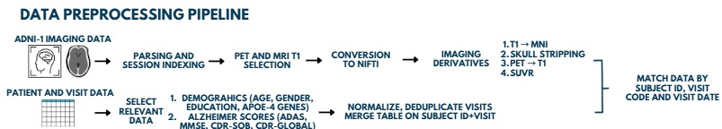
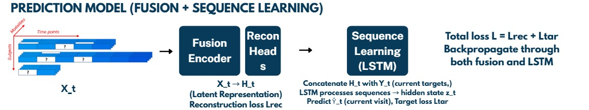
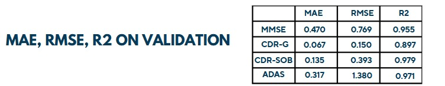

# Multi-Modal Alzheimer's Disease Progression Prediction

A deep learning framework for predicting cognitive decline in Alzheimer's disease using incomplete longitudinal clinical data. The model handles missing modalities and irregular visit patterns through a fusion-degradation architecture combined with LSTM-based temporal modeling.

## 🧠 Overview

This project implements a multi-modal sequence learning model that predicts cognitive assessment scores (MMSE, CDR-Global, CDR-SOB, ADAS-Cog) from longitudinal patient data. The model is designed to handle real-world challenges in clinical data:

- **Missing modalities** at individual visits
- **Irregular visit patterns** across patients  
- **Variable sequence lengths** per patient
- **Sparse target observations**

## 🏗️ Architecture

### Fusion-Degradation Module
- Encodes multi-modal inputs into 64-dimensional latent representations
- Reconstructs observed inputs only (masked reconstruction loss)
- Preserves modality-specific information without penalty for missing data

### Sequence Learning Module  
- LSTM processes temporal sequences with teacher forcing
- Predicts cognitive scores at each visit
- Joint optimization of reconstruction and prediction objectives

### Key Features
- **Masked losses** for handling missingness
- **Teacher forcing** for stable training
- **Automated checkpointing** with validation monitoring
- **Comprehensive evaluation** with MAE, RMSE, R² metrics

## 📊 Dataset

- **Source**: ADNI (Alzheimer's Disease Neuroimaging Initiative)
- **Size**: 18,437+ longitudinal patient visits
- **Features**: Clinical scores, demographics, imaging availability flags
- **Targets**: MMSE, CDR-Global, CDR-SOB, ADAS-Cog scores

